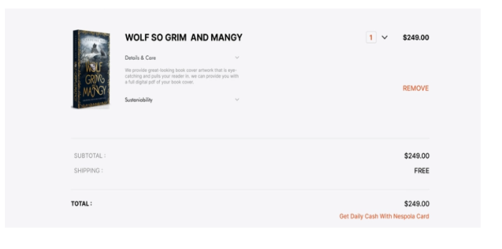
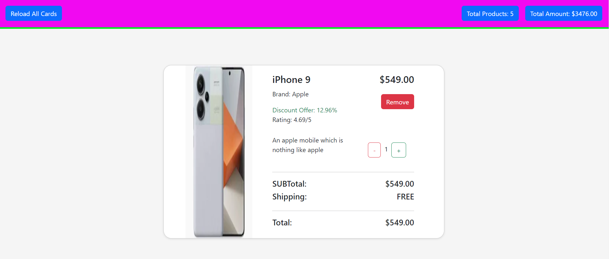

# React useContext Task

**Task Description**

 - https://drive.google.com/file/d/1fOadeM1liwbUK38z92F0XYugk2jwqK2r/view?usp=share_link

 - From the above link, get JSON data and create a cart page with per item price , per item quantity, Total quantity and total amount

**Functionalities Required**

 - It needs to increase or decrease the per unit quantity, which should automatically update the total Quantity and Amount.

 - Code Must Use Only ContextAPI  to perform all necessary functions
  
**For Reference**

  

 **Description**
   
   * In [Index.html](./index.html)
      
      - This is an HTML document that sets up a basic web page with React and Bootstrap, including a root element for the React application and scripts to load Bootstrap and the React application.
   
   * In [App.jsx](/src/App.jsx) 
     
      - This React component, `App`, wraps the `B` component with a `ProductProvider` from a product context to provide context values to `B` and its child components.
      - The `ProductProvider` component is imported from the `productcontext` file, which likely contains a context for managing product-related state.

   * In [productcontext.jsx](/src/context/productcontext.jsx)  

      - This code creates a `ProductContext` using React's `createContext`, with a `ProductProvider` component that manages an array of products using the `useState` hook and provides this state to its children via the context.
      - The `useProducts` hook is defined to allow easy access to the `ProductContext`, enabling components to consume the product state and updater function.
    
   * In [B.jsx](/src/components/B.jsx)

      - The `B` component utilizes the `useProducts` hook to access and update the product state managed by the `ProductContext`.
      - Inside a `useEffect` hook, it fetches product data from `/product.js`, parses the JSON response, and updates the `products` state using `setProducts`.
      - The component renders a `CardData1` component, presumably to display the fetched product data.

   * In [product.js](/public/product.js) 

      - This JSON array contains a list of product objects, each detailing various attributes of smartphones including id, title, description, price, discount percentage, rating, stock, brand, category, thumbnail, and image URLs.

   * In [CardData.jsx](/src/components/carddata1.jsx) 

      - **Component Setup**: `CardData1` is a React component that uses the `useProducts` hook to access and manage product data from the context, and it also maintains local state for the total number of products (`totalCardCount`) and the total amount (`totalAmount`).
      - **Initial Calculations**: In a `useEffect` hook, it calculates the initial total count and amount based on the products array, considering quantities if available, and sets these values in the component's state.
      - **State Updaters**: It defines functions `updateTotalCardCount` and `updateTotalAmount` to incrementally update the total number of products and total amount, respectively.
      - **Product Removal**: The `removeProduct` function filters out a product by its id from the products array and updates the context state.
      - **Rendering and Event Handling**: It renders a `NavBar` component with props for total count, total amount, and a page refresh handler. It also maps over the products array to render a `Card` component for each product, passing necessary props for updating counts, amounts, and removing products.

   * In [Card.jsx](/src/components/card.jsx) 

      - **Component and Initial State**: The `Card` component initializes a state variable `quantity` with the product's quantity or defaults to 1. It also imports styles from `card.css`.
      - **Effect for Quantity Update**: A `useEffect` hook updates the product's quantity property whenever the local `quantity` state changes.
      - **Increase Quantity Function**: The `increaseQuantity` function increments the quantity, updates the total card count and amount using the passed functions, and returns the new quantity.
      - **Decrease Quantity Function**: The `decreaseQuantity` function decrements the quantity (if greater than 1), updates the total card count and amount, and returns the new quantity.
      - **Calculate Price with Quantity**: The `getPriceWithQuantity` function calculates the total price based on the product price and current quantity.
      - **Remove Product**: The `removeProduct` function is invoked when the "Remove" button is clicked, removing the product from the list.
      - **Rendering Product Details**: The component renders the product image, title, price, brand, discount offer, rating, description, and quantity adjustment buttons.
      - **Displaying Totals**: The component calculates and displays the subtotal, shipping cost (assumed free), and total amount based on the current quantity. 

   * In [Card.css](/src/components/card.css)  

      - This CSS styles the body with a whitesmoke background, defines a flexible, centered container with a shadow and rounded borders, and styles cards with hover effects, specific dimensions, and structured content, including image and text formatting.
       
   * In [Navbar.jsx](/src/components/Navbar.jsx)      

      - **Component Structure**: The `NavBar` component displays a navigation bar with a reload button and information about the total number of products and the total amount.
      - **Props Handling**: It accepts `totalCardCount`, `totalAmount`, and `handleRefreshPage` as props, displaying the count and amount, and calling the refresh handler on button click.
      - **Styling**: The component uses CSS classes from `Navbar.css` for styling the navbar and its elements, ensuring a consistent layout and appearance.

   * In [Navbar.css](/src/components/Navbar.css)    

      - CSS for a fixed-positioned navigation bar with space-between alignment, displaying total product count and amount, ensuring a consistent layout and appearance.

 **Steps to run this code:** 
  
  1. Set up a React development environment on your local machine if you haven't already. You can do this by installing Node.js and npm, and then using Create React App or setting up a React project manually.

  2. Create the necessary file structure for your project, including the `src` folder for your React components and other source files.

  3. Copy the provided React components and CSS styles into your project files. Ensure that the file paths and imports are correctly set up.

  4. Install any dependencies required by the project, such as `"react": "^18.2.0"` and ` "react-dom": "^18.2.0"` and `"react-router-dom": "^6.23.1"`, by running `npm install` in your project directory.

  5. Once everything is set up, you can start your development server by running `npm run dev` in your project directory. This command will compile your React code and start a development server, typically running on `http://localhost:5174/`, where you can view your application in a web browser.

  6. If you're using any external resources or APIs, make sure they are accessible and correctly configured in your code.

  7. Finally, open your web browser and navigate to `http://localhost:5174/` (or the appropriate address if your development server is running on a different port) to see your React application in action.

 Remember to make any necessary adjustments to fit your specific project setup, such as configuring routes, managing state, and connecting to backend services if needed.

  **Output:**
       

**future enhancements:**
    
    Implementing user authentication and a backend server for managing user accounts and persisting product data.